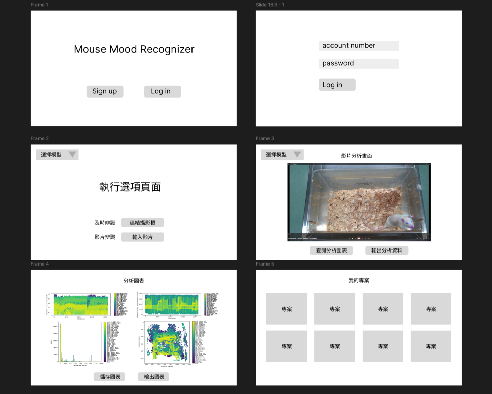

## 分鏡板
[分鏡圖連結](https://embed.figma.com/design/Ytb3eoumjLE0lfNbWDKvHe/MU-HW6?node-id=0-1&embed-host=share)  

##### 說明
- 使用者會從桌面應用程式進入頁面
- 使用者先進行登入後進入執行選項頁面。
- 可選擇直接輸入影片分析也可以選擇連接攝影機及時分析也可以選擇分析用之模型。
- 可以於影片分析畫面了解分析情形，並輸出資料或查閱圖表。
- 可於查閱圖表頁面選擇儲存或輸出圖表。
- 另外專案選擇頁面可供使用者選擇要進行分析之專案。
